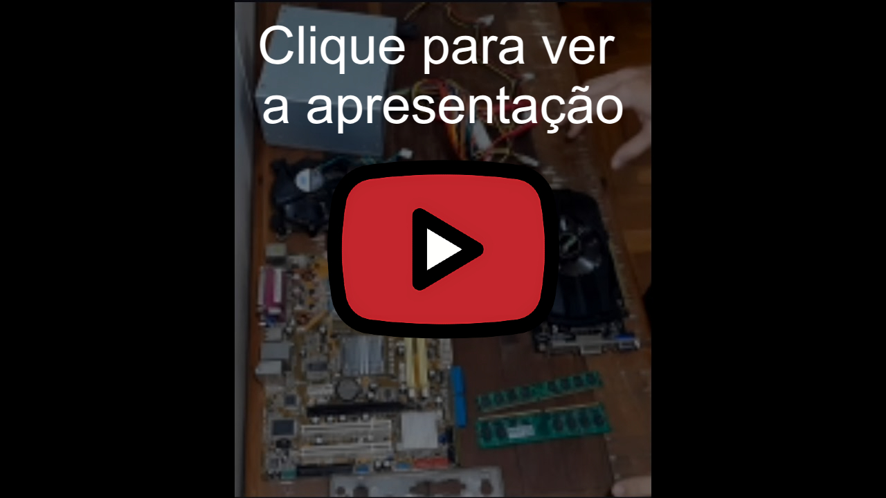

# Como Montar Seu Próprio PC – Guia para Iniciantes

Este projeto foi criado e apresentado para a comunidade **Podcodar** com o objetivo de ensinar os membros sobre as peças que compõem um computador e como montá-las passo a passo.

## 📺 **Assista ao vídeo aqui**: [Link do YouTube](https://www.youtube.com/watch?v=IciRZKxuWaQ)

## Sobre o Vídeo

No vídeo, eu explico de forma simples:

- Para que serve cada componente (CPU, GPU, RAM, etc)
- Como escolher peças compatíveis
- Como montar o PC do zero
- Dicas práticas e erros comuns

## Componentes Utilizados

- CPU: [modelo]
- Placa-mãe: [modelo]
- RAM: [modelo]
- GPU: [modelo]
- Armazenamento: SSD 80gb
- Fonte: generica 300w
- Gabinete: generico

## Referência

Parte do conteúdo e da estrutura foi inspirada neste vídeo:

- [How to build a PC, the last guide you'll ever need!](https://www.youtube.com/watch?v=BL4DCEp7blY)

## Licença

MIT – sinta-se livre para usar, modificar e compartilhar.
